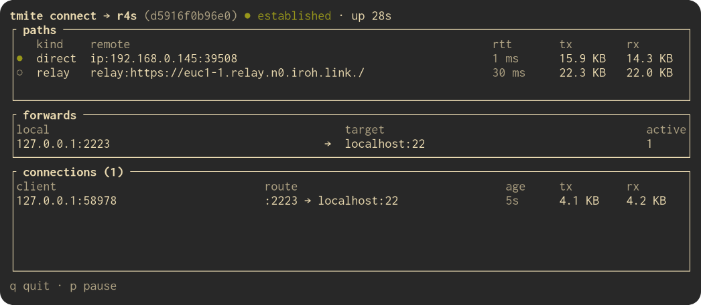

<h1 align="center">tmite</h1>

<p align="center">
  
</p>

Temporary forwarding tunnels between two machines over
[iroh](https://crates.io/crates/iroh): encrypted QUIC with NAT traversal and
relay fallback, dialed by NodeId. A long-lived daemon runs on a server with a
persistent iroh identity; laptops pair with it once using a 5-word spoken
code, after which the admin grants them access to specific TCP endpoints. The
client runs local listeners and carries traffic over a single multiplexed
iroh connection.

```
tmite daemon                                 # on the server
tmite admin peers invite --name laptop       # prints a 5-word code, waits
tmite pair "ocean pixel falcon ..."          # on the laptop
tmite admin peers allow laptop localhost:22
tmite connect laptop --fwd 2222:localhost:22
ssh -p 2222 localhost
```

## Layout

```
tmite-proto/   framing codec, pairing-code codec + HKDF, IPC types, limits
               (pure: no tokio, no iroh)
tmite-core/    all async logic: endpoint builder, daemon (data plane,
               invites, IPC, state), client (pair, session, connect)
tmite/         the `tmite` binary: clap parsing, prompts, printing, exit codes
vectors/       golden pairing vectors + handshake transcript (CI regenerates)
```

## Install

Nix flake:

```sh
nix build github:arnarg/tmite
```

## Usage

### NixOS module

```nix
{
  inputs.nixpkgs.url = "github:nixos/nixpkgs/nixos-26.05";
  inputs.tmite.url = "github:arnarg/tmite";

  outputs = { nixpkgs, tmite, ... }: {
    nixosConfigurations.myserver = nixpkgs.lib.nixosSystem {
      modules = [
        tmite.nixosModules.default
        {
          services.tmite.enable = true;

          # Optional: fixed UDP port if a firewall needs a static allow rule,
          # self-hosted iroh infrastructure (the public n0 relays rate-limit).
          # services.tmite.port = 42991;
          # services.tmite.relays = [ "wss://relay.example.com" ];
          # services.tmite.pkarr = "https://pkarr.example.com/pkarr";

          # Add your user to the "tmite" group to run admin commands.
          # users.users.<username>.extraGroups = [ "tmite" ];
        }
      ];
    };
  };
}
```

This runs `tmite daemon` as a systemd service with state in `/var/lib/tmite`
(`StateDirectory=tmite`) and the admin IPC socket in `/run/tmite/daemon.sock`
(`RuntimeDirectory=tmite`, mode 0660). Users in the daemon's group can run the
admin CLI; for a non-root daemon the socket lives in `$XDG_RUNTIME_DIR/tmite/`
instead.

### Run from source

Development (everything under the repo):

```
mkdir -p data run
cargo run -- daemon --data-dir ./data --socket-path ./run/daemon.sock
cargo run -- peer invite  --data-dir ./data --socket-path ./run/daemon.sock --name laptop
cargo run -- peer allow   --data-dir ./data --socket-path ./run/daemon.sock laptop localhost:22
cargo run -- node-id      --data-dir ./data
```

## Development

```sh
cargo build                                   # build
cargo test --workspace                        # all tests, fully offline
cargo clippy --all-targets -- --deny warnings # what nix flake check enforces
cargo fmt
nix flake check                               # clippy (--all-targets --deny warnings) + fmt gates
```

Regenerate the committed golden vectors after changing the pairing scheme:

```
cargo run -p tmite-core --example gen_vectors
cargo run -p tmite-core --example gen_transcript
```

## Pairing model

- The 5-word code encodes 40 bits of entropy plus a checksum byte; the invite
  endpoint's keypair is derived from the entropy via HKDF-SHA256
  (salt `tmite/v1`, info `invite`). The daemon's persistent key is never
  derived from the code.
- The code is a bearer rendezvous secret only: pairing completes after the
  admin compares the client's NodeId on both terminals (`y/N` prompt read
  from `/dev/tty`; `--yes` skips it for scripting).
- Invites are single-use, default TTL 900 s (cap 3600), ≤ 8 concurrent.
  Rejected codes die immediately; the server's identity is pinned by the
  client at confirm (TOFU, `known_hosts`-style).

## Data plane

One iroh connection per client session, one bidirectional QUIC stream per
forwarded TCP connection. Frames (`u8 type | u32be len | JSON`) carry
`FORWARD` / `OK` / `DENY`; after `OK` the stream is an opaque byte pipe with
mandatory half-close propagation (TCP FIN ⇄ stream `finish()`). ACLs are
exact string matches administered per peer via
`peer allow/revoke/ls/rm`; no wildcards.

## Exit codes

`0` success · `1` fatal/usage · `2` invalid/expired code · `3` admin denied ·
`4` timeout · `5` server unreachable.

## Testing notes

Integration tests use offline loopback iroh endpoints (`presets::Minimal`,
direct addresses exchanged in the harness); pairing-over-the-network is
exercised by `docs/smoke.sh` by hand, including the half-close check
(`ssh … ; exit` must return promptly).
